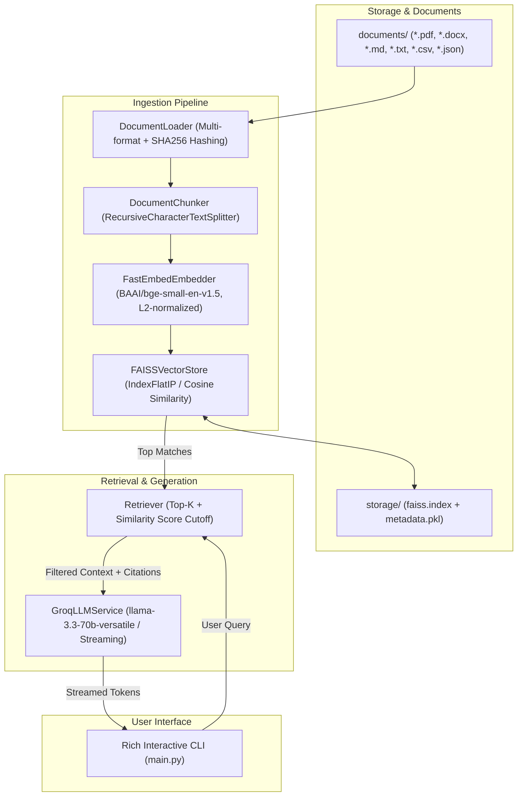

# Scalable FAISS-Based RAG CLI Chatbot

A high-performance, modular, and strictly grounded Retrieval-Augmented Generation (RAG) CLI assistant built in Python. It ingests multi-format documents from the `documents/` folder, builds an incremental **FAISS** vector index, and answers questions **strictly and solely** from the provided documents.

---

## Architecture Highlights



### Key Engineering Features
1. **Clean / Layered Architecture**:
   - `src/config.py`: Strongly-typed configuration via `pydantic-settings`.
   - `src/load_document.py`: Multi-format document loader (`.pdf`, `.docx`, `.md`, `.txt`, `.csv`, `.json`) with SHA-256 hash detection.
   - `src/chunker.py`: Recursive semantic text chunking with deterministic IDs and page/file metadata.
   - `src/embedding.py`: Abstract `BaseEmbedder` with `FastEmbedEmbedder` (fast CPU ONNX inference with L2 normalization).
   - `src/vector_store.py`: Abstract `BaseVectorStore` with `FAISSVectorStore` implementing exact Cosine Similarity (`faiss.IndexFlatIP`) and disk persistence.
   - `src/search.py`: `Retriever` with similarity score thresholding and citation provenance.
   - `src/llm.py`: `GroqLLMService` with token streaming, anti-hallucination guardrails, and graceful API key handling.
   - `src/rag_pipeline.py`: High-level orchestrator facade.
2. **Incremental Indexing**:
   - Automatically tracks SHA-256 hashes of files in `documents/`.
   - On startup, if no files were added or modified, loads the pre-computed FAISS index from disk instantly (< 50ms startup).
3. **Strict Document Grounding**:
   - Refusal Guardrail: If a query is outside document domain or below similarity cutoff (default `0.55`), the system immediately answers:
     > *"I am sorry, but based on the provided documents, I do not have enough information to answer this question."*
   - Zero hallucination and zero wasted LLM API tokens on irrelevant queries.
4. **Rich Interactive CLI**:
   - Real-time token streaming, formatted source citations with scores, diagnostics, and slash commands.

---

## Quick Start

### 1. Requirements & Setup
Ensure you have Python >= 3.10 and `uv` (or `pip`):

```bash
# Clone the repository and navigate inside
cd RAG_Project

# Install dependencies using uv
uv sync
```

### 2. Environment Configuration
Create or edit your `.env` file in the project root:

```env
GROQ_API_KEY=gsk_your_groq_api_key_here
GROQ_MODEL=llama-3.3-70b-versatile
```
*(Get a free API key at [console.groq.com](https://console.groq.com)).*

---

## Usage

### Interactive Chat Mode
Launch the interactive CLI chat session:
```bash
uv run main.py
```

#### Interactive Commands:
- `/help`: Display available commands
- `/stats`: Display document and vector store statistics
- `/sources`: View detailed citation snippets from the last query
- `/reindex`: Force re-indexing of all files in `documents/`
- `/clear`: Clear terminal screen
- `/exit` or `/quit`: Exit the session

### One-Shot CLI Query Mode
Execute a query directly from your terminal and exit:
```bash
uv run main.py -q "What is Omraj's experience with LangChain and Agentic AI?"
```

### Check System & Vector Store Stats
```bash
uv run main.py --stats
```

### Force Full Re-indexing
```bash
uv run main.py --reindex
```

---

## Running Unit Tests

To run the automated test suite verifying ingestion, chunking, FAISS persistence, retrieval thresholding, and pipeline guardrails:

```bash
uv run python -m unittest discover -s tests
```
